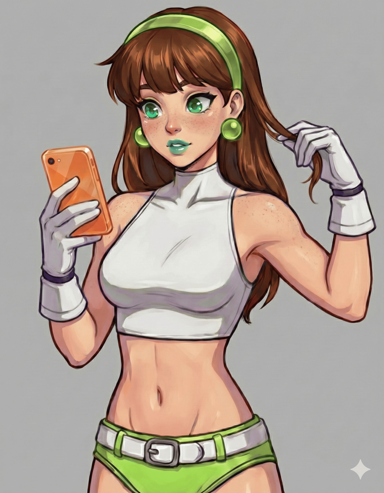
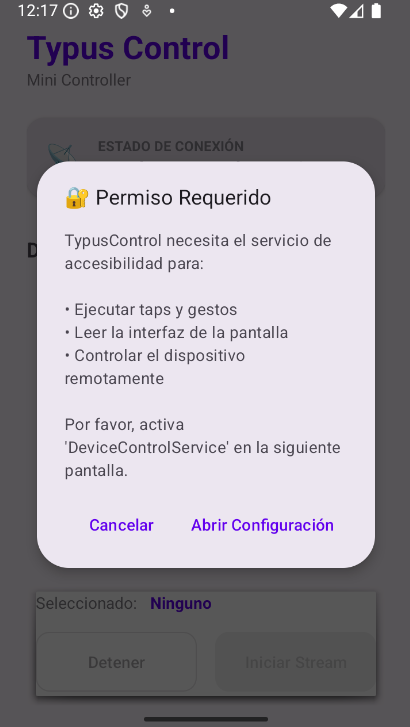
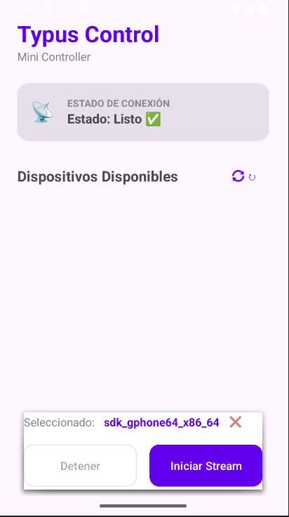
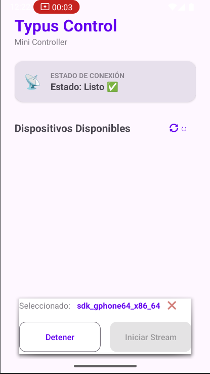

# Typus Control Mini

> Interfaz de Telemetría visual y ejecución remota (Aplicación Streamer para AsyncControl).

TypusControl Mini actúa como el *Client Side* dentro de la arquitectura de AsyncControl. Esta aplicación cumple el rol de "ojos y manos" del sistema, encargándose de dos funciones críticas, 



- 1: Streamer (Telemetría): Captura y transmite el estado de la pantalla en tiempo real hacia el componente Monitor de ``AsyncControl``.
- 2: Actuador (Ejecución): Escucha, decodifica y ejecuta los comandos serializados provenientes de la Consola de ``AsyncControl``, traduciéndolos en acciones nativas sobre la interfaz de usuario.

> Es, en esencia, el sistema nervioso que conecta tu PC con la interfaz física de tu dispositivo Android.

## Estructura esperada para los comandos
Todos los comandos se envían como una cadena JSON. La estructura básica de un comando es la siguiente:

```json
{
  "type": "command",
  "id": "optional_command_id",
  "command": "command_name",
  "param1": "value1",
  "param2": "value2"
}
```

-   `type`: Debe ser siempre `"command"`.
-   `id`: (Opcional) Un identificador único para el comando, que se devolverá en la respuesta para el seguimiento.
-   `command`: El nombre del comando a ejecutar.
-   `parameters`: Parámetros específicos del comando.

### Comandos Soportados

Aquí hay una lista de los comandos soportados y sus parámetros:

-   **`tap`**: Simula un toque en la pantalla.
    -   `x`: La coordenada x (Float).
    -   `y`: La coordenada y (Float).
    -   *Ejemplo*: `{"type": "command", "command": "tap", "x": 100.0, "y": 200.0}`

-   **`press`**: Simula una pulsación larga en la pantalla.
    -   `x`: La coordenada x (Float).
    -   `y`: La coordenada y (Float).
    -   `duration`: (Opcional) La duración de la pulsación en milisegundos (Long). Por defecto es 500.
    -   *Ejemplo*: `{"type": "command", "command": "press", "x": 100.0, "y": 200.0, "duration": 1000}`

-   **`swipe`**: Simula un deslizamiento en la pantalla.
    -   `startX`: La coordenada x inicial (Float).
    -   `startY`: La coordenada y inicial (Float).
    -   `endX`: La coordenada x final (Float).
    -   `endY`: La coordenada y final (Float).
    -   `duration`: (Opcional) La duración del deslizamiento en milisegundos (Long). Por defecto es 300.
    -   *Ejemplo*: `{"type": "command", "command": "swipe", "startX": 100.0, "startY": 800.0, "endX": 100.0, "endY": 200.0}`

-   **`inputText`**: Introduce texto en el campo actualmente enfocado.
    -   `text`: El texto a introducir (String).
    -   *Ejemplo*: `{"type": "command", "command": "inputText", "text": "Hello World"}`

-   **`back`**: Simula la pulsación del botón de retroceso.
    -   *Sin parámetros.*
    -   *Ejemplo*: `{"type": "command", "command": "back"}`

-   **`home`**: Simula la pulsación del botón de inicio.
    -   *Sin parámetros.*
    -   *Ejemplo*: `{"type": "command", "command": "home"}`

-   **`recents`**: Abre la pantalla de aplicaciones recientes.
    -   *Sin parámetros.*
    -   *Ejemplo*: `{"type": "command", "command": "recents"}`

-   **`getUI`**: Recupera la jerarquía de la interfaz de usuario de la pantalla actual.
    -   *Sin parámetros.*
    -   *Ejemplo*: `{"type": "command", "command": "getUI"}`

-   **`getElements`**: Recupera una lista de elementos de la interfaz de usuario interactuables en la pantalla.
    -   *Sin parámetros.*
    -   *Ejemplo*: `{"type": "command", "command": "getElements"}`

## Screenshots

**Solicitud de permisos de accesibilidad**


**Pantalla principal de la aplicación**


**Transmitiendo la pantalla**

